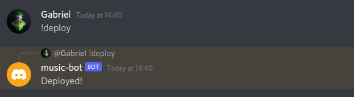
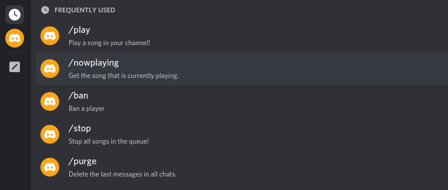
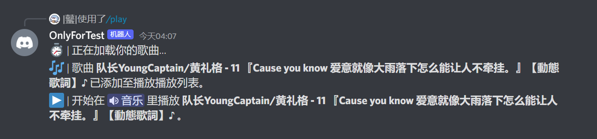

<!-- # Discord Music bot

A simple discord bot that helps you manage your server by providing useful commands like playing music or deleting text messages.

You can find the tutorial about building a discord music bot [here](https://zerone.org/blog/dicord-music-bot). 

## Table of content

* [Requirements](#requirements)
* [Getting started](#getting-started)
* [Common errors](#common-errors)
* [Contributing](#contributing)
* [Author](#author)
* [License](#license)

## Requirements

- [Node](https://nodejs.org/en/) - Version 16 or higher
- [NPM](https://www.npmjs.com/)
- [FFMPEG](https://www.ffmpeg.org/)
- [Docker](https://www.docker.com/) (optional)

## Getting started

First, make sure you have all the required tools installed on your local machine then continue with these steps.

### Installation

"""bash
# Clone the repository
git clone https://github.com/ZerOne/discord-bot.git

# Enter into the directory
cd discord-bot/

# Install the dependencies
npm install
"""

## Required permissions

**Important:** Make sure that your bot has the "applications.commands" application scope enabled, which can be found under the "OAuth2" tap on the [developer portal](https://discord.com/developers/applications/)

### Configuration

After cloning the project and installing all dependencies, you need to add your Discord API token in the config.json file.

### Starting the application

"""bash
node index.js
"""

### Starting the application using Docker

"""bash
# Build the image
docker build --tag discordbot .

# Run the image
docker run -d discordbot
"""

## Deploying commands

Before you can use the bots slash command you first need to add them to your Discord server. You can use the "!deploy" command to do so.

After deploying the commands you should be able to see and access them by typing a slash:

## Features & Commands

> Note: The repository now uses the new Discord slash commands

* 🎶 Play music from YouTube via url

"/play YOUTUBE_URL"

* 🎶 Play music from using song name

"/play SONG_NAME"

* 📃 Pause music

"/pause"

* 🎓 Resume music

"/resume"

* 💿 Skip song

"/skip"

* 🔇 Stop music

"/stop"

* 🔀 Shuffle Queue

"/shuffle"

* ↕ Move song position

"/move TRACK_POSITION TARGET_POSITION"

* ↔️ Swap song positions

"/swap POSITION_1 POSITION_2"

* ⏏️ Remove song

"/remove POSITION"

* Now Playing (/nowplaying)
* Get information about a user (/userinfo USER)
* Ban a player (/ban USER)
* Delete the latest chat messages (/purge NUM_OF_MESSAGES)

## Common errors

Here is a list of common errors and how you can fix them.

### Dependencies aren't up to date

The packages used in this repository get updated often, especially the ytdl-core package. That is why it is always worth a try updating those if you get an error like "invalid URL: undefined" or when the bot crashes when running the play command.

"""bash
npm install ytdl-core@latest
"""

### FFMPEG is not installed on the machine running the bot

The "play" command requires FFMPEG to be installed on the machine that is running the bot. You can download it on the official [FFMPEG website](https://www.ffmpeg.org/). Note: This isn't relevant if you use the Dockerfile because it will install FFMPEG inside of the container.

## Contributing

You are welcome to contribute by submitting a Pull Request to the repository.

## Author

[ZerOne](https://zerone.org/)

## Support me

## License

This project is licensed under the MIT License - see the [LICENSE.md](LICENSE) file for details -->

# Discord Music bot

一个简单的discord机器人，通过提供有用的命令，如播放音乐或删除文本信息，帮助你管理你的服务器。

##内容表

* [要求](#requirements)
* [开始](#开始-开始)
* [常见错误](#common-errors)
* [贡献](#contributing)
* [作者](#author)
* [许可证](#license)

##要求

- [Node](https://nodejs.org/en/) - 版本16或更高
- [NPM](https://www.npmjs.com/)
- [FFMPEG](https://www.ffmpeg.org/)
- [Docker](https://www.docker.com/) (可选)

## 开始使用

首先，确保你在本地机器上安装了所有需要的工具，然后继续执行这些步骤。

### 安装

"""bash
# 克隆版本库
git clone https://github.com/ZerOne/dc-bot.git

# 进入该目录
cd dc-bot/

# 安装依赖项
npm install
"""

## 需要的权限

**重要的是：**确保你的机器人启用了"applications.command"应用范围，这可以在[开发者门户](https://discord.com/developers/applications/)上的"OAuth2"选项下找到。

### 配置

在克隆项目并安装所有的依赖项后，你需要在config.json文件中添加你的Discord API token。

### 启动应用程序

"""bash
node index.js
"""

### 使用Docker启动应用程序

"""bash
# 构建镜像
docker build --tag discordbot .

# 运行该镜像
docker run -d discordbot
"""

##部署命令

在你使用bots斜线命令之前，你首先需要将它们添加到你的Discord服务器上。你可以使用".deploy"命令来做到这一点。

。

部署命令后，你应该可以通过输入斜线来查看和访问它们。

## 功能和命令

> 注意：版本库现在使用新的 Discord 斜线命令

* 🎶 通过网址播放YouTube上的音乐

"/play YOUTUBE_URL"。

* 🎶 使用歌曲名称播放音乐

"/play SONG_NAME"。

* 📃 暂停音乐

"/pause"（暂停

* 🎓 继续播放音乐

"/resume"。

* 💿 跳过歌曲

"/skip"。

* 🔇 停止播放

"/stop"。

* 🔀 打乱列表

"/shuffle

* ⒉ 移动歌曲位置

"/move TRACK_POSITION TARGET_POSITION"。

* ↔️交换歌曲位置

"/swap POSITION_1 POSITION_2"。

* ⏏️移除歌曲

"/remove POSITION"。

* 正在播放（/nowplaying）
* 获取一个用户的信息 (/userinfo USER)
* 禁止一个玩家 (/ban USER)
* 删除最新的聊天信息 (/purge NUM_OF_MESSAGES)

## 常见错误

下面是一个常见错误的列表，以及你如何解决这些问题。

### 依赖不是最新的

此存储库中使用的包经常更新，尤其是 ytdl-core 包。这就是为什么如果您收到诸如"无效 URL：未定义"之类的错误或当机器人在运行播放命令时崩溃时，总是值得尝试更新这些内容的原因。

"""bash
npm install ytdl-core@latest
"""

### FFMPEG 未安装在运行机器人的机器上

"play" 命令要求在运行机器人的机器上安装 FFMPEG。 可以在官方[FFMPEG 网站](https://www.ffmpeg.org/)上下载。 注意：如果您使用 Dockerfile，这无关紧要，因为它会在容器内安装 FFMPEG。

## 贡献

欢迎您通过向存储库提交拉取请求来做出贡献。

## 作者

StarGolx & ZerOne

## 执照

这个项目是在 MIT 许可下获得许可的 - 有关详细信息，请参阅 [LICENSE.md](LICENSE) 文件