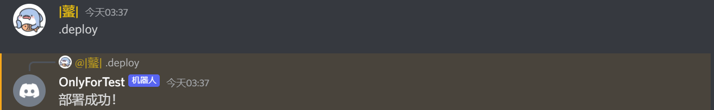
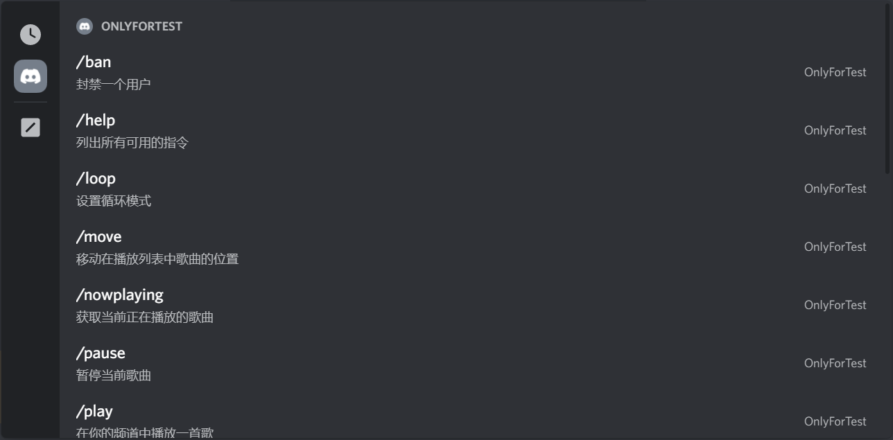

# Discord Music Bot

一个简单的娱乐型discord机器人，通过命令，如播放音乐或删除文本信息，（稍微）帮助你管理你的服务器。

## 内容表

>* [开始](#开始使用)
>* [FAQ](#FAQ常见问题)
>* [错误](#错误)
>* [贡献](#贡献)
>* [作者](#作者)
>* [许可证](#许可证)

---

## 开始使用

## 部署命令

在您使用机器人斜线命令之前，你首先需要将它们添加到你的Discord服务器上，然后就可以使用`.deploy`命令来部署指令。



部署命令后，你应该可以通过输入斜线来查看和访问它们。



---

## 功能和命令

* 🎶 通过网址播放YouTube上的音乐：

```
/play <YOUTUBE链接>
```

* 🎶 使用歌曲名称播放音乐：

```
/play <歌名>
```

* ⏸️ 暂停音乐：

```
/pause
```

▶️ 继续播放音乐：

```
/resume
```

* ⏭️ 跳过歌曲：

```
/skip
```

* ⏹️ 停止播放：

```
/stop
```

* 🔃 打乱列表：

```
/shuffle
```

* 移动歌曲位置：

```
/move <歌曲编号> <目标位置>
```

* 🔄️ 交换歌曲位置：

```
/swap <歌曲1> <歌曲2>
```

* 🗑️ 移除歌曲：

```
/remove <歌曲编号>
```

当前播放的歌曲只需要用`/skip`命令就行了。

* ⏯️ 正在播放：

```
/nowplaying
```

* 获取一个用户的信息：

```
/userinfo <用户>
```

* 封锁一个玩家：

```
/ban <用户>
```

* 删除最新的聊天信息：

```
/purge <信息数量>
```


## FAQ常见问题

* ### 如何查看歌曲编号？

只需要输入这窜命令就行了：

```
/queue
```

下一首歌曲对应的是编号1，以此类推。

## 错误

如果发生某种错误，请通过Issues联系本人并附上图片来进一步确定解决方案，谢谢。

## 贡献

欢迎您通过向存储库提交拉取请求来做出贡献。

## 作者

@ZsOg & @SZG0

## 许可证

这个项目是在 MIT 许可下获得许可的。有关详细信息，请参阅 [LICENSE](LICENSE) 文件。
